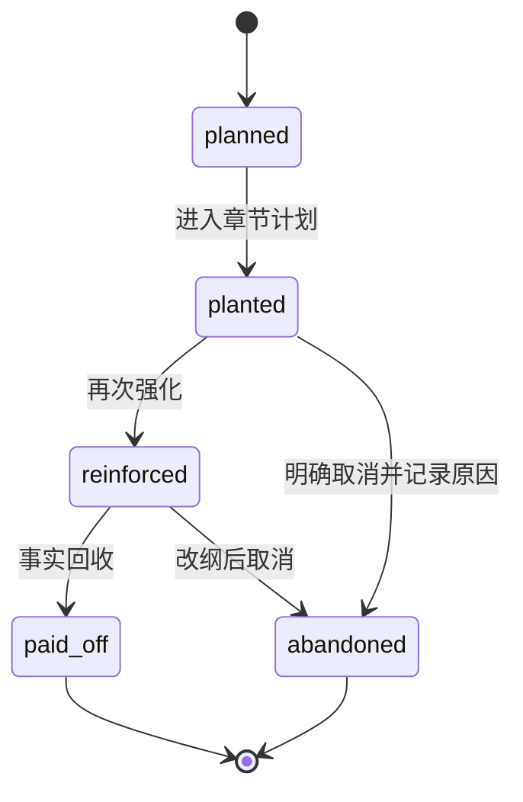

# 玄穹文枢 10 万字长篇创作与系统全面优化计划

> 文档版本：v1.0
> 编制日期：2026-09-21
> 适用仓库：`/run/csi/mount-root/nas/4079184d856ecc166ed19d4887083405/qwenpaw-data/xuanqiong-wenshu`
> 目标分支：`codex/server-us010-r1`
> 性质：执行计划、验收契约、回滚手册和长篇内容生产规范

## 0. 一页结论

玄穹文枢当前具备继续工程化的基础：后端全量回归 `291 passed`，前端 `118 passed`，8013 公网后端、8099 回环后端和 5174 前端可以启动，拓扑和运行时依赖审计通过，R65 已证明 94 项 runtime snapshot 可以在一次性隔离 venv 中独立重建。

但“服务健康”不等于“10 万字生产链路完成”。当前必须按证据推进四类问题：

1. **前端深链接阻断**：`/` 正常，但直接访问 `/workspace`、`/admin`、`/settings` 等 history 路由由 `python3 -m http.server` 返回 404，Vue 根节点不存在；这会破坏刷新、分享链接、回退和部署后的路由恢复。
2. **Embedding 未形成真实能力**：探针结果为 `EMBEDDING_CONFIG_MISSING`，向量为空、维度为 0；正文生成成功不能替代 RAG 成功证据。
3. **MySQL 未进入可执行状态**：当前仍是 SQLite，MySQL 密码未配置，FK planner 识别 `chapters <-> chapter_versions` 和 `timeline_events` 自引用环；apply 必须继续关闭。
4. **10 万字生产契约尚未物化**：已有 pipeline、版本、上下文、质量门和取消清理能力，但还需要把 10 万字目标拆成可追踪的卷、章、场景、伏笔、人物状态、上下文快照、成本和验收记录。

完成定义不是“生成一段很长的正文”，而是：系统能够分批生成、审核、修订并恢复一部约 100,000 个中文字符的长篇小说；每章有可追溯的输入、版本、质量门、成本和连续性证据；失败不会误报成功，也不会污染已确认内容。

## 1. 范围与不变量

### 1.1 范围

| 层面 | 目标 |
|---|---|
| 产品链路 | 项目、蓝图、章节、候选稿、确认稿、管理台和导出闭环 |
| 生成引擎 | Provider、重试、SSE、取消、超时、usage attribution 可审计 |
| 长篇能力 | 10 万字配额、卷章规划、连续性账本、伏笔回收、角色和世界状态 |
| 运行部署 | 8013/8099/5174 的进程、提交、依赖、路由和回滚一致 |
| 数据演进 | SQLite dry-run、MySQL preview、FK cycle 方案、备份和回滚演练 |

### 1.2 受保护不变量

1. `process_commit == current_commit`，且 `working_tree_dirty=false`；
2. 8013 是公网入口，8099 是回环内部入口；
3. 每个生成任务只有一个最终 terminal event；
4. Provider 超时、余额不足、认证失败、模型不可用保留原始错误分类；
5. `waiting_for_confirm` 只表示候选稿已落库，不表示最终稿已选定；
6. superseded/cancelled/failed run 不得写入新的确认版本、usage 归属或错误账本；
7. 新修复必须有专项回归和反向验证；
8. 不删测试、不调高阈值、不用静默 fallback 制造绿灯；
9. 空向量不能写成 RAG 成功；
10. 没有 readiness、备份和人工审查时不运行 migration apply；
11. 每轮代码或文档变更都要在服务器提交、推送 GitHub、重启受管服务并做拓扑审计。

## 2. 当前基线证据

### 2.1 提交与服务

```text
branch=codex/server-us010-r1
HEAD=1e9f4ae33f1cfb9584fbe2917ab10a297cca06dd
remote=origin/codex/server-us010-r1
8013=public_backend, 0.0.0.0
8099=internal_loopback_backend, 127.0.0.1
5174=frontend static server
```

最近轮次：

- R64：Vitest Node 25 Web Storage 噪声收敛，`b7ca803`；
- R65：runtime 依赖隔离重建，`feecc27`；
- R66：真实 Chromium 首屏与路由资源基线，当前工作树已采集，待提交。

### 2.2 已通过项

| 检查 | 结果 | 命令 |
|---|---|---|
| 后端全量 | `291 passed, 1 warning` | `bash scripts/test_backend.sh` |
| 前端类型 | PASS | `npm run type-check` |
| 前端测试 | `24 files, 118 tests` | `npm run test:run` |
| 前端构建 | PASS | `npm run build-only` |
| 入口预算 | PASS | `bash scripts/audit_frontend_entry.sh` |
| runtime audit | PASS | `bash scripts/audit_runtime_dependencies.sh` |
| 隔离 runtime 重建 | `94/94, failures=[], PASS` | `bash scripts/verify_runtime_rebuild.sh` |
| 拓扑/SQLite | `AUDIT_RESULT=PASS` | `bash scripts/audit_server_topology.sh` |
| FK planner | 只读、无连接、无写入 | `bash scripts/plan_mysql_fk_order.sh` |

### 2.3 当前阻断

Embedding：

```text
provider=openai
model=text-embedding-3-large
code=EMBEDDING_CONFIG_MISSING
vector_nonempty=false
vector_dimension=0
```

MySQL：

```text
db_provider=sqlite
mysql_password_set=false
execute=false
connected=false
writes_performed=false
status=BLOCKED
```

FK planner：

```text
table_count=57
edge_count=76
cycles=timeline_events -> timeline_events; chapters <-> chapter_versions
status=BLOCKED_BY_FK_CYCLES
```

前端 history fallback：

```text
GET /             -> 200, title=玄穹文枢, #app=true
GET /workspace    -> 404, title=Error response, #app=false
GET /admin        -> 404, title=Error response, #app=false
GET /settings     -> 404, title=Error response, #app=false
```

当前进程为：

```text
python3 -m http.server 5174 --directory frontend/dist --bind 0.0.0.0
```

根因是标准静态服务器不会把未知 history 路径回退到 `index.html`。

## 2.4 证据分层与权威性规则

所有结论必须标注证据层，不得把历史报告、测试夹具或计划目标写成当前生产事实：

| 证据层 | 含义 | 可证明什么 | 不能证明什么 |
|---|---|---|---|
| 历史证据 | 过去某次提交/服务/样本的输出 | 当时行为和结果 | 当前服务仍然如此 |
| 当前服务器证据 | 当前 SSH 工作树、进程、HTTP、数据库和日志 | 当前部署状态 | 未来优化已经完成 |
| 测试证据 | 自动化测试、fixture、mock、静态门禁 | 被覆盖的工程行为 | 真实 Provider 或文学质量 |
| 真实生产证据 | 当前入口、真实 Provider、真实正文和账本 | 生产链路事实 | 人工文学质量（除非有盲审） |
| 计划目标 | 本文定义的未来门槛 | 后续执行契约 | 已经达标 |

10 万字作品还必须建立一个不可覆盖的 `generation-manifest.json`，每章至少记录：

```text
project_id, volume_no, chapter_no, version_id, generation_run_id
provider, model, attempt, prompt_digest, context_digest
story_bible_digest, input_snapshot_digest, output_digest
quality_gate_result, human_review_result, accepted_at, accepted_by
```

自动评分、JSON 评审结果、字数达标和 HTTP 200 都不能单独证明文学质量通过。正式发布前至少抽取盲审样本，由两名独立审阅者按固定量表评分，分歧进入仲裁；审阅结果绑定版本 hash，不能被后续生成覆盖。

## 3. 10 万字长篇目标模型

### 3.1 计量口径

本计划把“10 万字”统一解释为约 100,000 个有效中文字符，以最终确认正文为计量对象；提示词、思考过程、质量报告、失败候选稿、重复重试、Markdown/HTML/JSON 标记、系统元话语、重复章节标题和纯空白不计入正文。

计数器必须同时输出原始字符数、剔除字符数、重复段落剔除数和有效正文字符数，不能直接把数据库 `content.length` 当作最终字数。

```text
目标有效正文：100,000 字
允许范围：97,000—103,000 字
```

### 3.2 五卷四十章配额

| 卷 | 主题职责 | 章节数 | 字数配额 | 单章均值 |
|---|---|---:|---:|---:|
| 第一卷：天穹裂隙 | 世界入口、主角缺口、第一条主线 | 8 | 18,000 | 2,250 |
| 第二卷：诸域回声 | 阵营展开、伙伴关系、第一次反转 | 8 | 20,000 | 2,500 |
| 第三卷：星海棋局 | 中段升级、代价、伏笔交叉 | 9 | 22,000 | 2,444 |
| 第四卷：旧王归墟 | 真相回收、关系决裂、终局压力 | 8 | 20,000 | 2,500 |
| 第五卷：玄穹终局 | 终极选择、主线闭合、余波落点 | 7 | 20,000 | 2,857 |
| **合计** |  | **40** | **100,000** | **2,500** |

不采用一次性生成 10 万字。生产层级：

- L0：全书总纲、五卷结构、角色/世界观字典；
- L1：单卷纲、卷内冲突、伏笔计划；
- L2：每 2—3 章的 continuity packet；
- L3：单章候选正文、质量报告、usage；
- L4：卷末修订版、伏笔回收报告和下一卷交付包。

每章必须有：目标、冲突、代价、信息增量、章末压力、递交给下一章的连续性事实。每章建议 3—5 个场景，不并行写同一项目中相互影响的章节。

## 4. 10 万字内容数据契约

### 4.1 章节对象

```json
{
  "project_id": "project-id",
  "volume_no": 1,
  "chapter_no": 1,
  "target_chars": 2250,
  "min_chars": 2100,
  "max_chars": 2700,
  "chapter_goal": "可验证的本章目标",
  "conflict": "本章主要阻力",
  "cost": "本章必须支付的代价",
  "reveal": "本章新增信息",
  "end_hook": "章末压力",
  "required_entities": [],
  "forbidden_contradictions": [],
  "foreshadowing_in": [],
  "foreshadowing_out": [],
  "continuity_snapshot_id": "snapshot-id"
}
```

### 4.2 连续性账本

账本分为人物、世界、道具、伏笔四类：

| 类别 | 记录内容 | 失配后果 |
|---|---|---|
| 人物 | 年龄、身份、伤势、能力、关系、秘密 | 行为失真 |
| 世界 | 地点、规则、势力、资源、时间线 | 世界观矛盾 |
| 道具 | 所有人、位置、状态、消耗、转移 | 关键道具瞬移 |
| 伏笔 | 埋设章、提示、预期回收、实际回收、状态 | 伏笔悬空或提前泄底 |

每个确认章节生成不可变 snapshot；修订必须生成新版本和新 snapshot，不覆盖旧账本。

### 4.3 伏笔状态机



卷末通过条件：关键伏笔 `paid_off + explicitly_open` 比例达到 95% 以上；取消伏笔必须有原因和替代作用；超过两个检查周期仍未 planted 的伏笔进入人工审查。

## 5. 系统优化路线图

### Phase 0：证据冻结（第 0—2 天）

固定 commit、PID、端口、数据库 schema fingerprint、291 项后端、118 项前端和 R66 浏览器输出；每轮更新 `OPTIMIZATION_ROUND_*.md` 和综合状态。

通过条件：

```text
git working tree clean
process_commit == current_commit
8013/8099/5174 healthy
topology AUDIT_RESULT=PASS
```

### Phase 1：P0 SPA history fallback（第 1 轮）

新增 `scripts/frontend_spa_server.py`，静态文件存在时正常返回；无扩展名且文件不存在时回退 `dist/index.html`；带扩展名的缺失资源仍 404；`/api` 不由静态服务器吞掉。同步更新启动/keepalive 和 manifest。

验收：

```text
GET /             -> 200, HTML, #app=true
GET /workspace    -> 200, HTML, #app=true
GET /admin        -> 200, HTML, #app=true，然后由 Vue 权限守卫处理
GET /settings     -> 200, HTML, #app=true
GET /assets/x.js  -> 真实文件 200
GET /missing.js   -> 404
```

反向验证：临时移除 fallback 分支时 `/workspace` 必须恢复为 404。

### Phase 2：P0 真实 Provider 与任务终态（第 2—3 轮）

创建独立临时项目，使用可控小预算发起单章生成；保存完整 SSE 帧，读取 chapter/version/usage，删除临时项目并运行 integrity/orphan audit。

通过条件：provider、model、attempt 可定位；terminal 恰好一个；正文非空可解析；usage 与 project/user/attempt 对齐；失败保留原始错误；删除后没有项目、章节、预算、usage 孤儿。health、队列 200、fallback 不计为成功。

### Phase 3：P0 Embedding 与 RAG（第 4—5 轮）

取得独立 embedding key/base URL 后运行 `scripts/probe_embedding.sh`；记录 provider、model、dimension、latency 和错误分类；用固定 20 条事实集比较无 RAG、降级 RAG、真实 RAG 的 top-k 命中；正文 Provider 和 embedding Provider 分开记账。

通过条件：`vector_nonempty=true`、`vector_dimension>0`、维度稳定、固定事实集达到预设命中阈值、embedding 失败不阻断无向量正文链且不伪造 RAG 成功。没有配置时继续保持 `EMBEDDING_CONFIG_MISSING`。

### Phase 4：P1 10 万字连续性引擎（第 6—9 轮）

物化以下模块：

- `LongformPlan`：全书/卷/章配额；
- `ContinuitySnapshot`：章节确认时的事实快照；
- `ForeshadowingLedger`：伏笔状态机；
- `CharacterState`：角色弧和当前状态；
- `WorldRuleLedger`：世界规则和例外；
- `ChapterDeliveryPacket`：递交给下一章的事实和压力；
- `RevisionImpact`：修订影响的后续章节列表。

规则：生成前读取最近确认 snapshot；生成后提取事实增量并检测冲突；阻断冲突不得确认；修订必须标记受影响章节；局部重写不允许无记录覆盖全局状态。

专项验收：跨 10 章人物状态不漂移、道具所有权稳定、时间线可排序、伏笔无非法跳转；故意注入矛盾时测试必须指出实体、章节和冲突字段。

### Phase 5：P1 成本、延迟、缓存（第 10—12 轮）

先统计 mission/context/variant/review/persist 的 p50/p95，再对不可变蓝图、世界规则和旧章摘要做版本化缓存；短章保留质量门和取消 drain；timeout 必须产生结构化 terminal。

通过条件：重复 context 计算下降、p95 有真实日志证据、取消不新增写入、缓存不改变事实、cost/token attribution 与无缓存版本一致。

### Phase 6：P1 依赖生产切换评估（第 13—14 轮）

R65 只证明独立重建可行，尚未替换生产 source。切换前必须用重建 venv 在隔离端口启动完整后端，跑 291 项回归、health、SSE、章节链路，比较 import source、版本和日志，逐个重启 8099/8013，保留旧入口和回滚命令。

### Phase 7：P0 MySQL runner 与回滚演练

只有 readiness、backup manifest、fragment hash、目标空库和人工审查齐全后进入副本演练：先建无环表，再复制主表和子表，最后添加 `chapters.selected_version_id` 外键和 `timeline_events.caused_by_event_id` 自引用约束；对比行数、约束和 schema fingerprint，再演练副本销毁/恢复。最后才允许 `--apply --backup-manifest`。

## 6. 单章、卷级和全书验收

### 6.1 单章

| 维度 | 通过条件 |
|---|---|
| 长度 | 目标值 ±10%，不低于 `min_chars` |
| 结构 | 目标、冲突、代价、信息增量、章末压力齐全 |
| 连续性 | 无阻断级人物、地点、道具、时间线矛盾 |
| 伏笔 | 输入处理可解释，输出有状态 |
| 风格 | 无系统提示、元话语泄漏，符合项目风格 |
| 质量门 | 结构、人物、节奏、场景、悬念检查完成 |
| 版本 | 候选/确认状态清晰，旧版可恢复 |
| 成本 | token、cost、provider、model、attempt 可追溯 |
| 事件 | SSE terminal 唯一，失败结构化 |
| 清理 | 无孤儿任务、版本和预算记录 |

### 6.2 卷级

每卷结束输出实际字符数、配额差、章节状态、主线推进、角色弧、世界规则、伏笔统计、未决线索、重复表达、Provider 失败/重试、成本和 p50/p95。主线缺失、关键人物无法解释、伏笔无记录丢弃、成功版本无 usage、账本不一致或有孤儿数据时不得进入下一卷。

### 6.3 全书

```text
final_chars ∈ [97000, 103000]
40 chapters planned and accounted for
5 volumes have volume reports
critical foreshadowing closure >= 95%
zero unresolved blocking continuity conflicts
all confirmed chapters have version and usage attribution
no orphan runs / versions / budgets
final export reproducible from confirmed versions
rollback can restore the last confirmed volume
```

## 7. 命令与反向验证矩阵

每轮代码变更：

```bash
bash scripts/test_backend.sh
cd frontend && npm run type-check && npm run test:run && npm run build-only
```

每轮部署：

```bash
bash scripts/audit_server_topology.sh
bash scripts/audit_runtime_dependencies.sh
bash scripts/audit_frontend_entry.sh
bash scripts/audit_frontend_browser.sh
```

专项：

```bash
bash scripts/probe_embedding.sh
bash scripts/audit_mysql_migration_readiness.sh
bash scripts/plan_mysql_fk_order.sh
bash scripts/verify_runtime_rebuild.sh
```

反向验证要求：

| 修复 | 破坏动作 | 必须出现的失败 |
|---|---|---|
| SPA fallback | 恢复纯静态 server | 深链接 404、appRoot=false |
| storage getter | 恢复直接 getter 读取 | Node 25 warning 重现 |
| FK planner | 修改 57/76 或删除 cycle 断言 | 测试失败 |
| 依赖重建 | 卸载 `aiosqlite` | exit=10、status=FAIL |
| 连续性门 | 注入人物事实矛盾 | confirmation 被阻断 |
| cancel drain | 完成前 cancel | 不得新增 confirmed version |

## 8. 提交、回滚和禁止事项

每轮一个主题提交，正文必须写目标、变更文件、测试、真实运行证据、反向验证、未完成项和回滚锚点，然后：

```bash
git push origin codex/server-us010-r1
```

回滚顺序：停止新进程、恢复上一提交/构建、恢复 manifest/PID、跑 health/topology；数据库只使用备份恢复，不做未经审查的逐表反向删除。

禁止：`git reset --hard`、`git clean -fd`、批量删除用户资产、提交 `storage/*.db-wal`/`*.db-shm`、提交真实密钥、把 mock/health/队列当真实成功、提高阈值掩盖问题、无 backup manifest 运行 apply。

## 9. 风险矩阵

| 风险 | 当前状态 | 监测 | 处置 |
|---|---|---|---|
| Provider 余额/认证 | 需复验 | status/error/token | 保留失败证据，暂停计费 smoke |
| Embedding key | 已阻断 | probe code | 保持降级，配置后单独验收 |
| 前端深链接 | 已发生 | browser audit | P0 SPA fallback |
| 上下文过长 | 潜在 | token/latency | snapshot、摘要、分层 context |
| 伏笔漂移 | 潜在 | ledger audit | 阻断级 continuity gate |
| SQLite 残留 | 需持续 | integrity/orphan | cancel/delete 回归 |
| MySQL FK cycle | 已发生 | planner | 两阶段约束、只在副本演练 |
| 依赖漂移 | 已审计 | runtime audit | 隔离重建和 source gate |
| Cloudflare 通道 | 外部依赖 | SSH/网页终端 | 每轮先确认通道，保留恢复脚本 |

## 10. 完成门

### 基础可用

SPA fallback 通过；`/`、`/workspace`、`/admin` 浏览器 appRoot 全为 true；8013/8099/5174 健康且提交一致；GitHub 推送和 topology PASS。

### 10 万字可生产

全书/卷/章配额、continuity snapshot、伏笔 ledger、单章生成/审核/确认/修订/取消/删除闭环完成；至少 5 章连续生成和 10 章连续性压力回归通过；成本和 usage 可追溯。

### 真实能力完整

真实 Provider 有非空正文和 usage；Embedding 返回非空向量并通过固定事实检索；RAG 成功/降级分开；MySQL 副本完成 FK migration/rollback rehearsal；依赖切换有隔离启动和生产回滚证据。

最终完成声明必须同时包含：

```text
HEAD=<commit>
origin=<same commit>
backend=<count> passed
frontend_typecheck=PASS
frontend_tests=<count> passed
frontend_build=PASS
browser_routes=/,/workspace,/admin all appRoot=true
spa_fallback=PASS
provider_real_nonempty=PASS
sse_terminal_unique=PASS
usage_attribution=PASS
embedding_vector_nonempty=PASS
rag_fact_retrieval=PASS
mysql_backup_manifest=PASS
mysql_fk_cycle_rehearsal=PASS
rollback_rehearsal=PASS
topology=AUDIT_RESULT=PASS
working_tree_dirty=false
```

当前下一步顺序：修复 SPA fallback；重跑浏览器基线；复验真实 Provider；配置后验收 Embedding/RAG；物化 10 万字计划和 continuity 数据模型；完成 5/10 章连续性回归；再评估依赖切换；最后进行 MySQL 副本演练。

本计划是验收契约，不是完成声明。每个阶段必须回写真实命令、输出、commit、进程、数据库和回滚证据。