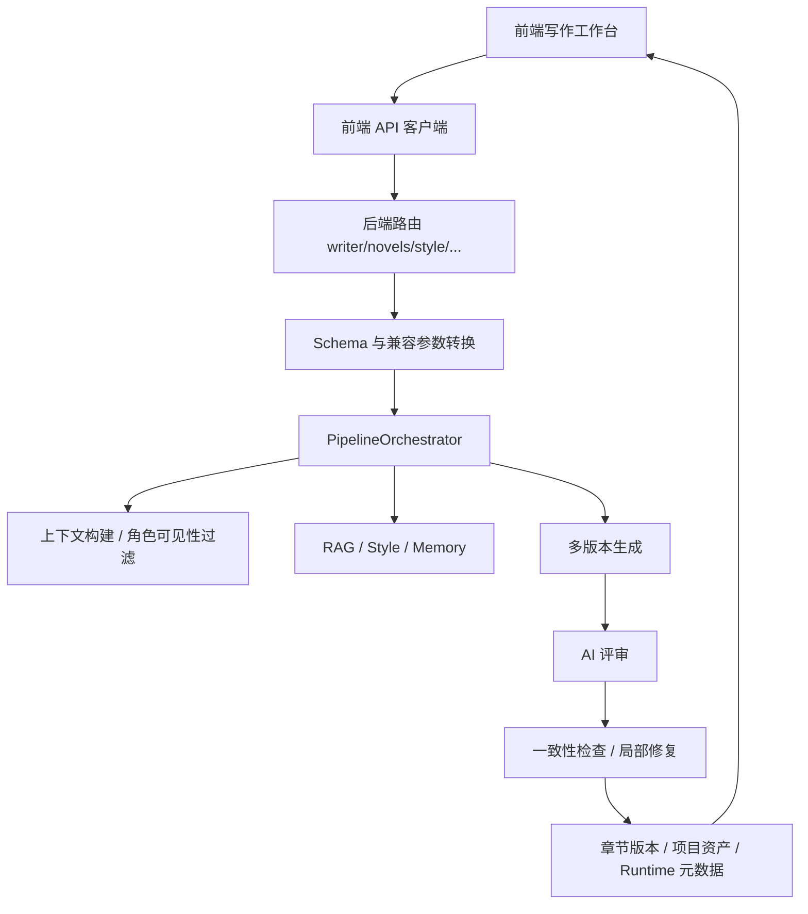
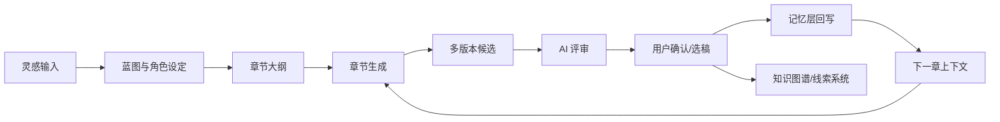

# `xuanqiong-wenshu` 项目结构、功能链路与优化方案研究报告

## Executive Summary

这次审计确认，`xuanqiong-wenshu` 并不是一个“功能太少”的项目，相反，它已经具备了长篇 AI 小说平台所需要的大部分关键模块：前端写作工作台、章节生成、多版本候选、AI 评审、记忆层、一致性检查、RAG、风格中心、知识图谱、线索追踪和 Token 预算等能力都已经存在。真正的问题不在“有没有”，而在“这些能力是否真正接入主链路、默认是否开启、前后端是否闭环、用户是否看得见”。

从源码来看，当前系统最大的问题是“能力很多，但主链路偏轻、闭环不完整、职责过度集中”。默认写作链路更接近“基础生成 + RAG”，而不是文档和界面所暗示的“完整高质量写作流水线”。这会直接带来三类后果：第一，小说质量和连续性高度依赖用户是否主动选对 preset；第二，前端暴露了大量工作台能力，但部分能力只停留在兼容层、展示层或旁路系统；第三，后端核心文件，尤其是 `pipeline_orchestrator.py` 和 `writer.py`，承担了过多逻辑，后续任何新增功能都容易继续堆在同一个入口上。

如果只看“现在能不能写出章节”，答案是能；但如果看“能不能稳定地持续生成几十章、还能保持连贯、高质量、可解释、低成本”，答案是还不够。这个项目下一阶段最该做的，不是继续堆新功能，而是把现有能力收口成稳定的主写作产品：收紧生成主链路，强制建立前后端闭环，减少旁路系统，拆解超大编排器，并让记忆、一致性、评审、降级信息和成本控制真正成为默认工作的一部分。

## Background / Context

`xuanqiong-wenshu` 的产品定位很明确：它不是一个一次性写短文的小工具，而是一个面向长篇小说、系列叙事、复杂世界观和多章节持续创作的 AI 写作平台。项目里已经能看到相对成熟的设计意识，比如分层写作理念、信息可见性过滤、防止“主角全知”、多版本候选、AI 评审、风格学习、角色状态追踪和一致性修复等。这说明项目不是从零开始，而是已经做到了“有体系雏形”的阶段。

但正因为目标高，系统对“连续性、可控性、闭环性”的要求也远高于普通 AI 写作工具。短文本系统可以容忍一些接口不一致、一些功能没接进主流程、一些 UI 只是未来占位；长篇小说系统不行。只要记忆层默认没开、线索系统不自动回写、质量链不是默认生效、降级不可见、状态轮询与生成状态脱节，用户写到十几章以后就会开始明显感受到：人物开始变形，伏笔开始遗忘，章节间承接松散，功能越来越多但使用成本越来越高。

这就是本次审计的核心出发点：不是看“项目有没有功能”，而是看“这些功能是否真的构成一个稳定的长篇写作系统”。

## 一、项目结构梳理

### 1.1 高层目录树

```text
xuanqiong-wenshu/
├── backend/
│   └── app/
│       ├── main.py
│       ├── api/routers/
│       │   ├── __init__.py
│       │   ├── novels.py
│       │   ├── writer.py
│       │   ├── outline.py
│       │   ├── style.py
│       │   ├── knowledge_graph.py
│       │   ├── clue_tracker.py
│       │   ├── token_budget.py
│       │   ├── optimizer.py
│       │   ├── analytics.py
│       │   ├── foreshadowing.py
│       │   ├── review.py
│       │   ├── llm_config.py
│       │   ├── admin.py
│       │   ├── projects.py
│       │   ├── patch_diff.py
│       │   └── writing_skills.py
│       ├── services/
│       │   ├── pipeline_orchestrator.py
│       │   ├── llm_service.py
│       │   ├── prompt_service.py
│       │   ├── novel_service.py
│       │   ├── memory_layer_service.py
│       │   ├── consistency_service.py
│       │   ├── ai_review_service.py
│       │   ├── knowledge_retrieval_service.py
│       │   ├── writer_context_builder.py
│       │   ├── longform_context_service.py
│       │   ├── preview_generation_service.py
│       │   ├── self_critique_service.py
│       │   ├── reader_simulator_service.py
│       │   ├── style_rag_service.py
│       │   └── token_budget_service.py
│       └── schemas/
│           └── novel.py
├── frontend/
│   └── src/
│       ├── api/
│       │   ├── novel.ts
│       │   ├── novel-client.ts
│       │   ├── config.ts
│       │   └── modules/
│       │       ├── chapterWorkflow.ts
│       │       ├── chapterEditing.ts
│       │       └── chapterDiff.ts
│       ├── stores/
│       │   └── novel.ts
│       ├── views/
│       │   ├── WritingDesk.vue
│       │   ├── NovelWorkspace.vue
│       │   ├── InspirationMode.vue
│       │   ├── StyleCenterView.vue
│       │   └── WorkspaceEntry.vue
│       └── components/
│           └── writing-desk/
├── docs/
│   ├── code-index/
│   └── audits/
├── tools/
├── output/
├── logs/
└── README.md
```

### 1.2 模块职责

后端的总体设计思路是清楚的：`routers` 负责对外 HTTP 能力，`schemas` 负责请求/响应契约，`services` 负责核心业务逻辑，`novel_service` 负责项目/章节数据读写，`pipeline_orchestrator.py` 负责把“上下文 → 生成 → 评审 → 修复 → 回写”串起来。前端则以 `WritingDesk.vue` 为工作台核心，通过 `chapterWorkflow.ts` 等 API 模块向后端发起生成、评审、版本选择和大纲相关请求。

也就是说，这个项目并不缺“分层意识”。问题出在分层之后，又出现了新的“重心过载”：路由层里的 `writer.py` 太重，编排层里的 `pipeline_orchestrator.py` 更重，前端工作台 `WritingDesk.vue` 也承担了非常多的总调度职责。系统不是没有层，而是这些层内部又各自长成了“大而全文件”。

### 1.3 已有设计亮点

几个地方值得肯定。第一，`writer.py` 明确写出了 L1 Planner、L2 Director、L3 Writer 的长篇写作分层理念，这说明项目并不是直接让模型“裸写正文”。第二，`writer_context_builder.py` 会过滤蓝图中的剧透信息，把 `full_synopsis`、完整 `chapter_outline`、`conversation_history`、`character_timelines` 等内容从 L3 Writer 视角剔除，避免正文模型知道不该知道的事。第三，`memory_layer_service.py` 不是简单做一个摘要表，而是试图维护角色状态、时间线和因果链，这对长篇系统来说方向是对的。

这些设计说明：项目的“概念层”并不弱。真正欠缺的是“把这些好设计稳定落到默认主链路里”。

## 二、系统结构图与功能关系图

### 2.1 系统结构图



### 2.2 功能关系图



### 2.3 结构上的核心矛盾

结构图看上去完整，但实际运行上存在一个核心矛盾：很多模块是“旁路存在”，并不是“默认主链的一部分”。从服务文件命名上看，你会以为系统已经是一条完整的“长篇写作工业流水线”；但从默认配置和调用路径上看，用户很多时候实际走的还是一条轻量路线。这种“架构表达很高级，但默认产品行为偏基础”的落差，是当前最重要的问题之一。

## 三、小说生成主流程与真实链路

### 3.1 真实生成步骤清单

当前章节生成主链，按源码核验后，可梳理为：用户在 `WritingDesk.vue` 里打开 `WDGenerateChapterModal.vue`，填写写作提示、质量要求、字数范围，然后前端通过 `chapterWorkflow.ts` 里的 `generateChapter()` 发起 `POST /api/writer/novels/{projectId}/chapters/generate` 请求。后端 `writer.py` 接到请求后，会做参数兼容和 preset 解析，再进入 `PipelineOrchestrator`。编排器之后会做上下文拼装、可见性过滤、RAG 检索、必要的记忆层接入、多版本生成、AI 评审、一致性检查与局部修复，最后把章节版本和运行元数据返回给前端。前端再基于状态轮询、版本选择器、评审详情、差异对比等组件给用户展示和后续操作。

### 3.2 真实调用链证据

`chapterWorkflow.ts` 中的前端调用很清楚：

```180:208:d:/小说写作/xuanqiong-wenshu/frontend/src/api/modules/chapterWorkflow.ts
export const generateChapter = (
  projectId: string,
  chapterNumber: number,
  options: GenerateChapterOptions = {},
) => {
  const payload: Record<string, string | number> = {
    chapter_number: chapterNumber,
  }
  if (options.preset) {
    payload.preset = options.preset
  }

  return requestProject(`${WRITER_BASE}/${projectId}/chapters/generate`, {
    method: 'POST',
    body: JSON.stringify(payload),
  })
}
```

后端入口也非常集中：

```75:93:d:/小说写作/xuanqiong-wenshu/backend/app/api/routers/writer.py
from ...services.pipeline_orchestrator import PipelineOrchestrator

router = APIRouter(prefix="/api/writer", tags=["Writer"])
logger = logging.getLogger(__name__)
DEFAULT_GENERATED_VERSION_COUNT = 1
MIN_GENERATED_VERSION_COUNT = 1
MAX_GENERATED_VERSION_COUNT = 4
```

前端工作台本身集成的功能很多，从 `WritingDesk.vue` 顶部工作台到版本详情、评审详情、章节编辑、生成大纲、生成章节、版本 diff、patch diff、技能选择器，几乎都挂在一个大页面里：

```232:270:d:/小说写作/xuanqiong-wenshu/frontend/src/views/WritingDesk.vue
<WDGenerateChapterModal
  v-if="showGenerateChapterModal"
  :show="showGenerateChapterModal"
  :project-id="project?.id"
  :chapter-number="pendingGenerateChapterNumber"
  :initial-writing-notes="generateChapterSeed.writingNotes"
  :initial-quality-requirements="generateChapterSeed.qualityRequirements"
  :initial-min-word-count="generateChapterSeed.minWordCount"
  :initial-target-word-count="generateChapterSeed.targetWordCount"
  @close="closeGenerateChapterModal"
  @generate="handleGenerateChapter"
/>
<WDSkillSelectorModal
  v-if="showSkillSelectorModal"
  :show="showSkillSelectorModal"
  :project-id="project?.id || ''"
  :chapter-number="selectedChapterNumber"
  @close="showSkillSelectorModal = false"
/>
```

### 3.3 真实流程与产品预期的偏差

从用户视角，工作台像一个成熟的“写作操作系统”。但从主链看，它更像一个“集成了很多能力入口的大型控制台”，其中有些功能已经实装，有些是兼容式过渡，有些还没有真正自动并入生成主线。也就是说，前端展现的是“平台完成度”，后端主链体现的是“局部成熟、整体尚未完全收口”。

## 四、前后端功能对齐审计

### 4.1 对齐矩阵

| 前端入口 | 前端 API | 后端路由 | 后端服务 | 当前判断 |
|---|---|---|---|---|
| 生成章节 | `generateChapter()` | `POST /chapters/generate` | `PipelineOrchestrator` | 已对齐 |
| 状态轮询 | `getChapterGenerationStatus()` | `GET /chapters/{chapter}/status` | writer runtime 状态 | 已对齐 |
| 评审版本 | `evaluateChapter()` | `POST /chapters/evaluate` | `AIReviewService` / writer | 已对齐 |
| 选择版本 | `selectChapterVersion()` | `POST /chapters/select` | writer / NovelService | 已对齐 |
| 取消生成 | `cancelChapterGeneration()` | `POST /chapters/cancel` | writer | 已对齐 |
| 大纲生成/改写 | `chapterWorkflow.ts` 相关方法 | writer 中 outline 相关接口 | writer / prompt / LLM | 基本对齐 |
| 风格中心 | `StyleCenterView.vue` | `style.py` | `style_rag_service.py` | UI 语义超前 |
| Token 预算 | 前端存在提示与配置路径 | `token_budget.py` | `token_budget_service.py` | 有能力但未深度接入主生成 |
| 线索追踪 | 前端有入口 | `clue_tracker.py` | `ClueTrackerService` | 与主生成链脱节 |
| 知识图谱 | 前端有入口 | `knowledge_graph.py` | `KnowledgeGraphService` | 主要依赖手动/旁路同步 |

### 4.2 已确认的前后端问题

第一类问题是“前端有入口，但后端能力并未完全按前端语义实现”。最明显的是风格中心。已有文档里已经留过一句非常关键的话，说明 UI 所谓的“大文本分批学习”并不完全等于原生后端能力，而是有过兼容性落地过程。这类问题不会让功能直接报错，但会让用户以为自己在用一个更成熟的能力闭环，实际却只是“能跑通”。

第二类问题是“后端有能力，但没有被主链默认消费”。知识图谱、线索追踪、Token 预算都是典型例子。它们不是不存在，而是更像外挂系统、旁路系统、管理系统，而不是生成主链天然的一部分。长期看，这会让项目继续“功能增长、闭环下降”。

第三类问题是“前端定义了状态字段，但后端回填是否稳定、是否全量、前端是否真正展示”不一定一致。比如 `GenerationRuntime` 这类运行元数据，前端类型能接住很多字段，但如果后端不总是回填、前端也没完整消耗，用户就感知不到这些能力的存在。

### 4.3 前端功能偏离预期的问题

`WritingDesk.vue` 集成度很高，但这也带来预期管理问题。用户在这个页面上看到的功能面板太多，容易自然预期“这些都已经自动工作”。然而从实际实现看，部分模块仍需要手动触发，部分状态只是局部可视化，部分高级链路只有高 preset 才会开启。这会形成典型的产品错觉：界面像 100 分，默认行为像 60–70 分。

## 五、质量、连续性与记忆问题

### 5.1 质量问题的根本原因不是模型，而是默认链路太轻

在 `pipeline_orchestrator.py` 里，`PipelineConfig` 默认值非常说明问题：

```79:103:d:/小说写作/xuanqiong-wenshu/backend/app/services/pipeline_orchestrator.py
@dataclass
class PipelineConfig:
    preset: str = "basic"
    version_count: int = DEFAULT_GENERATED_VERSION_COUNT
    enable_preview: bool = False
    enable_optimizer: bool = False
    enable_consistency: bool = False
    enable_enrichment: bool = False
    async_finalize: bool = False
    enable_constitution: bool = False
    enable_persona: bool = False
    enable_six_dimension: bool = False
    enable_reader_sim: bool = False
    enable_self_critique: bool = False
    enable_memory: bool = False
    enable_rag: bool = True
```

也就是说，默认真正打开的高级能力基本只有 `enable_rag=True`。这意味着用户默认拿到的不是“高质量长篇写作流水线”，而是“一条基础生成链 + RAG”。如果用户没有主动选择合适 preset，生成效果很容易落到“能写，但不稳”“有内容，但不像长篇系统应有的控制力”的区间。

### 5.2 连续性设计方向对，但默认保障弱

`memory_layer_service.py` 的设计很认真，它会维护角色在不同章节的状态快照，包括位置、情绪、健康状态、库存、目标、秘密等，还能在正文里识别新角色并自动入池：

```127:178:d:/小说写作/xuanqiong-wenshu/backend/app/services/memory_layer_service.py
async def update_character_state(
    self,
    project_id: str,
    character_name: str,
    chapter_number: int,
    state_updates: Dict[str, Any],
    character_id: Optional[int] = None,
    *,
    auto_commit: bool = True,
) -> CharacterState:
    """更新角色状态（创建新的状态快照）"""
```

这说明项目已经知道：长篇连续性不能只靠“摘要”，而要靠“状态”。问题是，这套机制在默认链路里不是始终强制生效。于是就出现结构上的矛盾：最懂长篇的模块，不一定总在用户实际写作时工作。

### 5.3 一致性检查是亮点，但还不够“硬”

`consistency_service.py` 的职责定义很准确：检查章节与既有设定、角色状态、前文摘要和剧情线是否冲突，优先局部修复，不轻易整章改写。这种“局部修补，不重写整章”的思路对写作系统很重要，因为它更贴合作者实际工作流。

```60:108:d:/小说写作/xuanqiong-wenshu/backend/app/services/consistency_service.py
CONSISTENCY_CHECK_PROMPT = """请检查下面章节是否与既有信息存在明显冲突。

[小说设定]
{novel_setting}

[角色状态]
{character_state}

[前文摘要]
{global_summary}

[剧情线/未解决问题]
{plot_arcs}

[当前章节]
{chapter_text}
```

问题在于，这个模块当前更像“能力库”而不是“硬约束系统”。只要它不是默认、强制、稳定地接在所有长篇生成链之后，用户依然会在多章节后遇到设定漂移和时间线回卷问题。

### 5.4 Prompt 规则是对的，但规则是否总能落地，要看上游上下文是否干净

项目里的写作提示词方向是好的，强调人物、冲突、情绪流动、对话攻防、连续性和反 AI 味。这些原则本身没问题。但 prompt 不是魔法。只要上游上下文拼装混乱、角色状态没有及时回写、前文摘要不稳、伏笔系统与记忆层没打通，再好的 prompt 也会被污染。当前项目的主要矛盾已经不在“有没有好提示词”，而在“这些提示词是否拿到了真正可信的上下文输入”。

## 六、效率与架构问题

### 6.1 `pipeline_orchestrator.py` 是当前最高风险文件

这份文件几乎把生成系统的关键动作都集中进来了：LLM 调用、上下文构建、RAG、记忆、一致性、自我批评、读者模拟、Token 预算、风格、降级、回写、运行元数据、版本管理，全部都在这个文件周围发生。它不是“一个编排入口”，而是在逐步演变成“系统总控中心”。

这种设计在项目早期很常见，因为它能让功能快速落地；但到了现在这个阶段，它已经开始反噬维护性。每增加一种新能力，就要在同一个文件里再加一层条件分支；每多一个 preset，就要重新考虑几十种能力组合的相互作用；每出现一次质量异常，排查路径就会变得更长。长远看，`pipeline_orchestrator.py` 必须拆。

### 6.2 `writer.py` 的路由层职责也过重

`writer.py` 不只是路由层。它还承担了参数兼容、默认字数逻辑、版本数推断、review 输入构造、大纲相关任务管理、后台任务控制、生成状态维护等职责。路由文件做到这种程度，意味着业务边界已经开始反向侵入接口层。继续这样长下去，任何接口变更都会更难测、更难定位副作用。

### 6.3 轮询和任务状态体系还有优化空间

当前前端状态轮询比最初已经成熟不少，但仍然偏“前端自己猜后端节奏”。工作台里既有章节生成状态、评审状态、选择状态，也有 outline job 的单独轮询。这不是说它不能用，而是说明“任务总线”还没有完全统一。如果后续继续增加异步任务，比如知识图谱重建、风格学习、章节批量修正、伏笔扫描等，现有轮询方式会继续膨胀。

### 6.4 旁路系统太多，造成系统复杂度虚高

知识图谱、线索追踪、Token 预算、风格中心、优化器、分析器、patch diff、写作技能、管理面板，这些模块单独看都很合理；但如果它们长期只以“各自成立”的方式存在，而不被整合进 2–3 条核心工作流，系统复杂度就会越来越像“平台工具箱”，而不是“围绕长篇写作主任务收敛的产品”。

## 七、外部标杆项目对比

### 7.1 GitHub 检索到的高价值候选

本次检索中，最值得关注的几个项目方向是：`nanfang-wuyu/AI-Novelist-RAG---Long-Form-Story-Generation-with-Memory`，明显强调长篇生成、记忆与世界观一致性；`MaoXiaoYuZ/Long-Novel-GPT`，强调 L1/L2/L3 分层写作；`ExplosiveCoderflome/AI-Novel-Writing-Assistant`，更偏完整端到端写作引擎；另外搜索结果中还出现了 `LLMWriter`、`webnovel-writer`、`NovelClaw` 等方向，普遍都把“记忆、RAG、多阶段写作、连续性控制、多智能体协作”当成核心卖点，而不是附属能力。

### 7.2 外部项目的共识

这些项目虽然实现细节不同，但共识很明显。第一，长篇写作几乎不会走“单次提示 → 直接出正文”的粗链路，而是要拆成规划、导演、正文、审查、回写等多个阶段。第二，记忆和 RAG 不是锦上添花，而是长篇系统的底盘。第三，多版本生成不是目标本身，真正重要的是评审、选择和回写。第四，可观测性很关键，用户需要知道系统当前在做什么、为什么这么做、质量为何发生变化。第五，长篇系统都在试图把“上下文污染”和“角色/设定漂移”当作一等公民问题去解决。

### 7.3 `xuanqiong-wenshu` 与标杆相比的真实差距

`xuanqiong-wenshu` 的差距并不在“没有这些理念”，而在“这些理念没有被默认、稳定、统一地落地”。换句话说，它不是比标杆少一个大模块，而是比标杆少一层“主链收口”。很多标杆项目会把记忆、RAG、阶段生成、可视化进度、质量审查天然当作主流程的一部分，而 `xuanqiong-wenshu` 目前更像：这些模块已经做出来了，但还在以多条支路并存。

## 八、微信公众号近一年中文资料的补充结论

本次用 `wechat-article-search` 按 2025-07-01 到 2026-07-04 的时间范围检索了两组关键词：一组是 `AI 长篇 小说 生成 记忆 RAG`，一组是 `AI 写作 长篇 故事 连贯性 多智能体`。检索结果虽然原文抓取受限，但标题和摘要已经足够形成中文技术社区的共识判断。

从结果看，中文圈对长篇 AI 写作的讨论高度集中在三个问题上：第一，AI 会忘记前文伏笔和角色状态；第二，单 Agent 或单提示模式很难稳定支撑几十万字以上的连载；第三，RAG、向量记忆、多智能体分工、导演式规划和交叉审查正在成为主流解决思路。检索结果里多篇文章都直接把“失忆症”“人设崩塌”“设定冲突率高”“多智能体互相检查”“RAG 让 AI 过目不忘”放在标题或摘要里，说明这已经不是个别项目问题，而是长篇写作赛道的共性难题。

这对 `xuanqiong-wenshu` 的启发很直接：项目现在的记忆层、一致性层、评审层和分层生成方向本身没走错，反而是对的；问题只在于它们还没有被彻底做成默认工作流。也就是说，这个项目不需要推翻重来，而是需要做一次“收口式升级”。

## 九、已确认问题、疑似问题、需实跑验证问题

### 9.1 已确认问题

已确认的问题主要有六类。第一，主生成链默认偏轻，很多高质量能力默认关闭。第二，`pipeline_orchestrator.py` 和 `writer.py` 职责过重，是当前维护风险最高的两个文件。第三，前端工作台功能很多，但一部分能力没有真正形成主流程闭环。第四，知识图谱、线索追踪、Token 预算等系统存在但更像旁路。第五，长篇连续性的关键机制已存在，但默认保障仍不够硬。第六，系统整体更像“多能力并存的平台”，而不是“围绕核心长篇生成流程收敛的产品”。

### 9.2 疑似问题

疑似问题主要集中在几个方面。第一，部分运行元数据字段虽然在前端类型里定义了，但后端是否所有路径都稳定回填，还需要进一步全链路抓包或实跑验证。第二，知识图谱和线索系统是否在用户日常流程里真正被消费，还是大部分时间停留在“可用但很少进入主写作链”，还需要结合真实使用路径确认。第三，某些前端组件是否在复杂状态切换时会出现 seed 状态清空、弹窗状态错位、生成任务追踪混乱等问题，单靠静态阅读还不能 100% 下结论。

### 9.3 需要实跑验证的问题

需要实跑验证的重点包括：不同 preset 下到底哪些能力真的被启用了；长篇项目连续生成 10–20 章后，角色状态和前文承接是否显著优于 basic；一致性修复是在多少比例的场景下有效，是否会引入新问题；知识图谱和线索追踪是否会自动跟随章节确认写后同步；Token 预算在预算逼近上限时是否真的会影响策略，而不只是发提示。

## 十、详细优化方案

### 10.1 阶段一：把“能跑”收口成“默认稳定”

这一阶段优先级最高，目标不是加功能，而是把现有最关键能力真正拉进默认工作流。核心动作包括：让长篇相关 preset 默认强制启用记忆层和一致性检查；让降级信息、实际 preset、质量链阶段、预算状态全部稳定回写并前端可见；把章节确认后的记忆回写、线索同步、知识图谱同步做成明确的写后闭环，而不是让它们长期以半手动方式存在。完成这一阶段后，用户至少能稳定知道：系统现在在用哪条质量链、为什么质量变化、哪些连续性能力已经生效。

### 10.2 阶段二：拆掉超重入口，重建主链分层

这一阶段的重点是后端重构，但不是推翻，而是抽离。建议把 `pipeline_orchestrator.py` 逐步拆成几个明确子编排段：上下文准备层、生成执行层、质量门控层、写后回写层、运行状态层。`writer.py` 则需要把 review 输入构造、outline job 管理、compat 参数推断、后台任务协调这些职责逐渐迁出。目标不是让文件变小本身，而是让“新能力加入时”不必继续往最重的两个文件里堆。

### 10.3 阶段三：收紧前端工作台，减少“看起来有、实际上不闭环”的感觉

前端不应该再继续无上限堆入口，而应该收缩成 2–3 条真正主工作流。最重要的一条是“章节写作主链”：生成、看多版本、评审、选择、确认、继续下一章。第二条是“设定/风格/知识管理链”：蓝图、风格中心、知识图谱、线索追踪、角色资产。第三条才是“高级修订/差分/局部优化链”：patch diff、候选版本优化、专项技能。现在的问题是三条链几乎都被压平到同一个工作台主页面上，导致学习成本和预期都偏高。建议后续通过产品层面重新梳理入口优先级。

### 10.4 阶段四：建立真正的质量门控

当前系统已经有 AI 评审、一致性检查、自我批评等机制，但还没有形成真正的质量门控策略。建议后续引入“质量分层接受标准”：比如 longform/ultimate 下，如果一致性检查出现 `critical` 且未修复，就不直接进入可确认状态；如果记忆层写后回写失败，要显式标记“本章未纳入连续性上下文”；如果 Token 预算受限导致走稳定降级，也要影响评审权重与用户提示。这样系统才不是“生成后顺便检查一下”，而是“检查结果真正决定章节流转”。

### 10.5 阶段五：把旁路系统变成主链配角，而不是独立宇宙

知识图谱、线索追踪、Token 预算、风格中心、优化器这些系统都值得保留，但不应该各自为政。建议把它们重新定位成主链配角：知识图谱和线索追踪优先服务“下一章上下文构建”；Token 预算服务“生成策略选择”；风格中心服务“风格上下文输入”；优化器服务“候选版本二次打磨”。只有这样，它们才会成为“增强主线”的能力，而不是增加系统理解成本的附属模块。

## Conclusion

综合本次审计，`xuanqiong-wenshu` 已经具备了成为一个优秀长篇 AI 小说平台的基础条件，甚至很多关键方向已经比普通写作项目更先进，比如分层写作思路、信息可见性过滤、角色状态记忆、一致性局部修复、多版本评审和风格学习。这说明项目并不是“方向错了”，而是“已经走到该收口的时候了”。

当前最核心的问题不是再去发散造新功能，而是把已经做出来的好能力，真正变成用户默认在走的主链路。只要把主链收紧、默认能力抬高、旁路系统回归主线、拆解超重入口，再补上前后端闭环和任务可观测性，这个项目就有机会从“功能丰富但有点散”的系统，变成“长篇写作稳定、连续、可控”的成熟产品。

如果按风险和收益排序，我认为最值得优先做的是三件事：第一，强制稳定长篇默认链路；第二，拆 `pipeline_orchestrator.py` 和 `writer.py`；第三，把工作台从“功能仓库”收敛成“主流程产品”。只要这三件事做对，后面的质量优化、成本控制和高级能力扩展才有长期价值。

## Limitations

本次审计以静态代码阅读、现有文档核验、GitHub 项目检索和公众号资料检索为主，没有在本轮直接对项目执行端到端实跑验证。因此，关于部分运行态字段是否全量回填、复杂异步状态在真实慢任务中的表现、线索/知识图谱/Token 预算在真实长篇项目中的长期联动效果，仍建议后续通过 `verify.ps1`、API smoke 测试和真实章节生成样本做第二轮实跑审计。

## References

1. [AI Novelist RAG - Long-Form Story Generation with Memory](https://github.com/nanfang-wuyu/AI-Novelist-RAG---Long-Form-Story-Generation-with-Memory)
2. [Long-Novel-GPT](https://github.com/MaoXiaoYuZ/Long-Novel-GPT)
3. [AI-Novel-Writing-Assistant](https://github.com/ExplosiveCoderflome/AI-Novel-Writing-Assistant)
4. [LLMWriter](https://github.com/zhangwen-max/LLMWriter)
5. [Long-Story Agent Project Page](https://xiao-zi-chen.github.io/CoLong-Idea-Studio/)
6. [NovelClaw 介绍页](https://agentskill.work/zh/skills/iLearn-Lab/NovelClaw)
7. [GitHub novel-writing topics](https://gitcn.org/topics/novel-writing)
8. [GitHub long-form-fiction topics](https://gitcn.org/topics/long-form-fiction)
9. [GitHub 中文社区 web-novel 专题](https://github-cn.com/topics/web-novel)
10. [GitHub 中文社区 ai-writing 专题](https://github-cn.com/topics/ai-writing)
