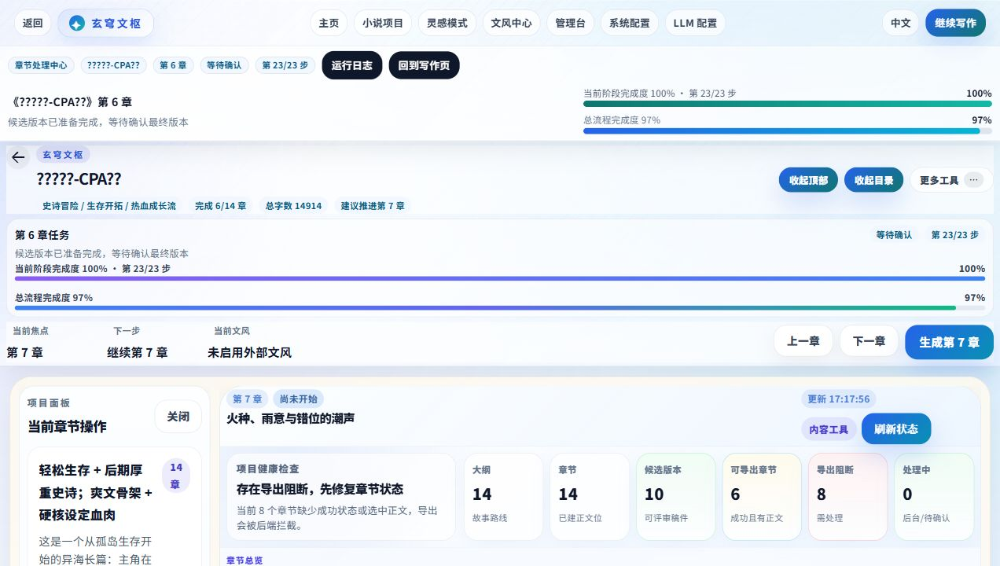

# 长篇生成与重写重构交付报告

日期：2026-05-20
分支：`codex/final-continuity-20260520`

## 目标

本次改造围绕“最开始生成/重写阶段”的质量、稳定性和长篇连续性展开，不另起一套小说引擎。已有的记忆层、伏笔、线索、势力、知识图谱、章节快照、终稿流水线继续作为主账本；新增能力只作为现有流程的接线、补强和验收。

外部借鉴重点来自成熟长篇写作工具的 Story Bible、setup/payoff 伏笔账本、Validator、结构化输出和 provider 抖动退避：

- [Sudowrite Story Bible](https://docs.sudowrite.com/using-sudowrite/1ow1qkGqof9rtcyGnrWUBS/what-is-story-bible/jmWepHcQdJetNrE991fjJC)
- [StoryLine setup/payoff 与 Validator](https://storyline.pixero.com/)
- [OpenAI Structured Outputs](https://platform.openai.com/docs/guides/structured-outputs?api-mode=chat)
- [OpenAI 429/backoff 指南](https://help.openai.com/en/articles/5955604-how-can-i-solve-429-too-many-requests-errors)
- [OpenAI Prompt Caching](https://platform.openai.com/docs/guides/prompt-caching)

## 功能地图

### 大纲和蓝图

- 前端入口：`BlueprintConfirmation.vue`、项目详情页、写作台的大纲生成/续写入口。
- API：`backend/app/api/routers/novels.py`、`backend/app/api/routers/writer.py`。
- 服务层：`NovelService` 负责蓝图、角色、章节大纲存储与序列化。
- 强化点：蓝图阶段要求生成长篇角色规模计划、角色生命周期、势力归属、知识边界、伏笔回收窗口；章节大纲阶段新增 `cast_delta`、`foreshadowing_tasks`、`payoff_window`。
- 进度：大纲/蓝图生成新增“设定锁定、角色生命周期、伏笔回收窗口”等可观测步骤。

### 正文生成和重写

- 前端入口：写作台生成章节、候选版本确认、状态进度条。
- API：`backend/app/api/routers/writer.py`。
- 流程编排：`backend/app/services/pipeline_orchestrator.py`。
- 强化点：正文生成前装配 `LongformContextPackage`，包括记忆、章节快照、角色状态、时间线、因果链、势力、知识图谱、伏笔/线索账本和本章任务。
- 稳定性：章节候选正文生成接入 `call_generation_text` 的重试、退避、超时、截断容忍和错误归因。

### 优化阶段

- API：`backend/app/api/routers/optimizer.py`。
- 强化点：优化合同从“整章优化”改为“局部窗口 + 前后锚点 + 返回完整章”。默认只改问题片段，保留事件顺序、角色状态、时间线和伏笔承接；严重结构问题才允许扩大范围。
- 长篇上下文：优化前也尝试装配长期上下文包，失败时降级为相邻章节锚点，不阻断优化。

### 伏笔、线索、知识图谱闭环

- API：`foreshadowing.py`、`clue_tracker.py`、`knowledge_graph.py`。
- 写前：本章伏笔任务区分 `must_resolve`、`should_reinforce`、`avoid_forgetting`、`may_plant`、`overdue_risks`。
- 写后：终稿确认后自动执行伏笔回收判断、自动收集、提醒检查、线索同步、知识图谱同步。
- 验收：`ContinuityQualityGate` 检查到期伏笔是否在正文可见，给出局部补丁建议，而不是默认整章重写。

## 关键代码改动

- 新增 `backend/app/services/longform_context_service.py`
  - `LongformContextPackage`：写前长期上下文包。
  - `CastPlan`：角色规模、层级、登场、势力和动态角色规则。
  - `ForeshadowingChapterTask`：本章伏笔埋设/强化/回收/禁忘任务。
  - `ContinuityQualityGate`：生成后跨章、伏笔、角色状态和知识边界检查。
- 修改 `backend/app/services/pipeline_orchestrator.py`
  - 新增 `audit_context`、`cast_plan`、`foreshadowing_plan`、`longform_context`、`continuity_gate` 阶段。
  - 正文生成前注入长篇上下文，生成后写入连续性质量门结果。
  - 正文候选生成接入可靠调用工具箱。
- 修改 `backend/app/services/foreshadowing_service.py`
  - 新增写后自动回收判断，命中关键词和回收窗口时记录 `ForeshadowingResolution`。
- 修改 `backend/app/api/routers/writer.py`
  - 终稿确认后串起记忆层、伏笔闭环、线索同步、知识图谱同步。
  - 章节大纲生成/重写提示词补充角色增量、伏笔任务和回收窗口。
- 修改 `backend/app/api/routers/novels.py`
  - 蓝图生成要求长篇角色规模计划、生命周期、势力归属、知识边界和伏笔回收窗口。
  - 蓝图角色命名修复接入 `call_generation_json`。
- 修改 `backend/app/services/novel_service.py`
  - 百万字长篇角色目标扩容到 42，并补足角色层级、登场章节、退出/回归、势力角色、知识边界和动态角色规则。
  - 即使初始章节大纲只有 12 章，也会从 `expected_chapter_range: 1-260章` 推断长篇规模。
- 修改 `backend/app/schemas/novel.py`
  - `ChapterOutline` 对外暴露 `cast_delta`、`foreshadowing_tasks`、`payoff_window`。
- 修改前端进度显示
  - `frontend/src/utils/chapterGeneration.ts`
  - `frontend/src/components/writing-desk/workspace/states/ChapterGenerating.vue`
  - `frontend/src/components/BlueprintConfirmation.vue`

## “可复用生成模块”大白话

它不是“所有 AI 调用都先交给同一个调度员”。这次没有做中央调度员，也没有把业务流程塞进一个大而乱的中心。

它更像一套可靠的工具箱：谁需要调用 AI，仍然由原来的业务服务负责，比如蓝图服务管蓝图、章节生成流程管正文、优化接口管优化。只是这些服务在真正向 provider 发请求时，可以复用同一套工具来做重试、退避、JSON 修复、超时、截断容忍和错误说明。这样减少重复代码，也降低 provider 抖动导致整步失败的概率。

## 实跑产物

测试项目：`90d8445e-c795-4b58-abe6-a10ba1c6d118`
CPA 配置：`http://localhost:8317/v1`，模型 `gpt-5.4`，API key 已配置。

- 正文生成第 5 章：生成候选版本 `323`，约 2559 字符，已选择为成功章节。
- 正文生成第 6 章：生成候选版本 `324`，约 1979 字符，运行阶段包含 `audit_context`、`cast_plan`、`foreshadowing_plan`、`longform_context`、`continuity_gate`，连续性门通过。
- 第 6 章大纲重写：返回执行型章节大纲，保留承接和回收窗口。
- 第 6 章优化：`rhythm` 维度返回完整章节，说明只做局部节奏优化，未默认整章重写。
- 后续章节大纲生成：生成第 13-14 章，并在 API schema 中返回 `cast_delta`、`foreshadowing_tasks`、`payoff_window`。
- 伏笔 API：自动收集 2 条伏笔。
- 线索 API：从伏笔同步出 2 条线索，线索线程分析可用。
- 知识图谱 API：从故事记忆同步出角色节点。

浏览器验证截图：

## 多视角评判

### 作者视角

生成前不再只拿相邻章节，正文会看到角色层级、角色状态、记忆摘要、伏笔账本和本章任务。长篇写作时更不容易出现“第 100 章突然忘了第 8 章的物品/秘密/人物状态”的情况。

对应代码修正：新增 `LongformContextPackage`，在 `pipeline_orchestrator.py` 注入正文提示词。

### 编辑视角

章节大纲从“摘要”升级为“可执行任务”：角色变化、冲突升级、连续性说明、伏笔动作和回收窗口都有结构化字段。这样能在正文生成前先降低任务不清导致的卡死和跑偏。

对应代码修正：`ChapterOutline` schema 和生成/重写提示词新增结构化字段。

### 读者视角

优化阶段不再默认切碎正文或整章重写，而是用局部窗口和前后锚点修问题片段。读者看到的章节承接、情绪流、场景顺序更稳定。

对应代码修正：`optimizer.py` 的优化合同改为 `local_window_with_anchors_return_full_chapter`。

### 连续性审校视角

伏笔不只是“收集出来看看”，生成前会进入任务，生成后会检查可见回收或强化，未回收时给局部补丁建议。到期/高重要度伏笔会进入质量门 blocker。

对应代码修正：`ForeshadowingChapterTask`、`ContinuityQualityGate`、`auto_resolve_from_chapter`。

### 系统稳定性视角

没有新增中央 AI 调度员。业务流程仍分散在对应服务里，可靠调用能力逐步复用到生成/修复/抽取步骤。provider 429、超时和临时 5xx 更容易被重试和归因。

对应代码修正：正文生成和蓝图修复接入 `generation_call_service.py`。

## 验证结果

- 后端：`python -m pytest backend -q` -> `160 passed`
- 前端：`npm test -- --run` -> `108 passed`
- 静态检查：`git diff --check` 无空白错误，仅有既有换行符提示。
- 浏览器：首页和写作台可渲染，控制台 error 为 0。
- API 实跑：伏笔、线索、知识图谱、章节生成、大纲重写、优化均已用本地服务验证。

## 已知限制

- 旧测试项目中部分中文历史数据在 PowerShell 输出里显示乱码，这是历史数据/控制台编码问题；浏览器页面和 UTF-8 文件可正常工作。
- 本次没有把所有旧散落 AI 调用一次性硬改完，优先接入了正文候选生成、蓝图修复、章节大纲和优化链路。后续可以继续按“工具箱复用”的方式迁移评审/抽取类调用。
- 长篇连续性门目前以结构化账本和关键词可见性为主，已经能防止明显遗忘；更深的语义级矛盾检测可以继续接入轻量评审模型，但不应该阻塞正文保存。
